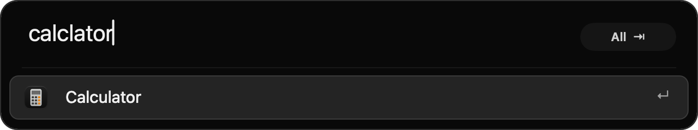
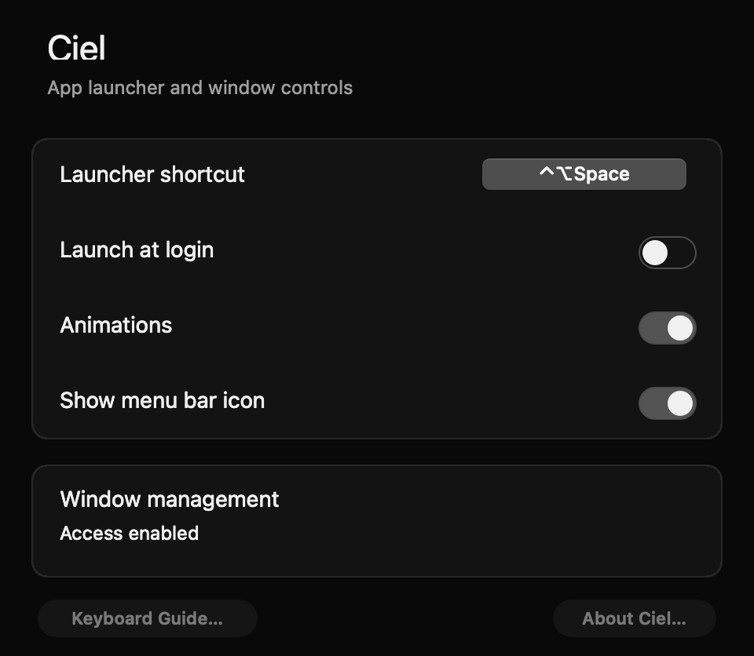

<p align="center"></p>

# Ciel

[](https://github.com/mauriciopolvora/ciel/actions/workflows/checks.yml)

A small native macOS launcher for apps and window commands. Open it, type, and press Return.

Ciel uses Swift and AppKit. It runs locally, with no account, server, analytics, or runtime network requests. The interface stays black in both macOS light and dark appearance. Its icon is an original Monet-inspired cloud painting.


Results appear after you type. Clearing the input returns to the empty box.



## Build and install

Ciel is available as source. A notarized download is not available yet.

Requires **macOS 14 or later** and a **Swift 6 toolchain**. Apple's Command Line Tools are sufficient for local builds. Full Xcode is optional.

```sh
git clone https://github.com/mauriciopolvora/ciel.git
cd ciel
bash scripts/build.sh
bash scripts/install.sh
open ~/Applications/Ciel.app
```

The scripts create `dist/Ciel.app` and install it in `~/Applications`. Quit the installed launcher before an update. If its menu bar icon is hidden, use Activity Monitor to quit it. Installation saves the previous app under `.build/backups`. Existing Jumpstart preferences and usage history remain compatible.

Local builds use an ad-hoc signature. They are not notarized public releases. macOS window access may need approval again after a rebuild. See the [release guide](docs/releasing.md) for Developer ID signing, notarization, universal builds, and distribution.

## Use

The default shortcut is **Control–Option–Space**. Existing users keep their saved shortcut. Change it in Settings.

| Key | Action |
| --- | --- |
| Type | Search apps and window commands |
| ↑ / ↓ | Select a result |
| Return | Run the selected result |
| ⌘1 … ⌘9 | Run one of the first nine results |
| Tab / Shift–Tab | Change search category |
| Escape | Close Ciel |
| ⌘, | Open Settings |

The launcher opens with a focused, empty input. It has no placeholder, symbols, or suggestions. Results and the category button appear only after you type. Hold Command to reveal result shortcuts. Click the category button to switch between All, Apps, and Windows. The empty launcher is 68 points tall. It expands to fit search results. App icons and window outlines identify each result.

Search supports prefixes, abbreviations such as `vsc`, typing errors such as `safrai`, accents, and multiple words in any order. Exact matches take priority over usage history. Successful app launches and window commands update local ranking for future searches. The empty launcher stays blank.

Drag the empty input, or the border around a populated search, to move Ciel. White guides divide the usable display at one-quarter, one-half, and three-quarters. Nearby guides brighten. Release within 24 points to snap the input center to a guide. Hold Option to place it freely. Guides disappear when you release the mouse. Ciel remembers each display’s position across reopening and restart.

The cloud icon in the menu bar provides Settings, Keyboard Guide, Window Shortcuts, Rescan Applications, About, License Notices, and Quit. Launch at login is optional in Settings.

To hide the cloud icon, turn off **Settings → Show menu bar icon**. This takes effect immediately and stays off after restart. Open the launcher and press **Command–Comma** to return to Settings and show the icon again. You can also open Ciel from Applications if the launcher shortcut is unavailable.



## Window commands

App search works without Accessibility access. Window commands require it. Choose **Ciel Settings → Allow Access**, then enable the installed Ciel app in macOS privacy settings. Focus the window you want to change, then open Ciel. Ciel retains that target window.

Commands include halves, quarters, thirds, maximize, almost maximize, center, restore, minimize, and moving between displays. Set optional global shortcuts in **Window Shortcuts**. Press Escape to cancel recording. Press Delete to clear a window shortcut. Conflicts leave the previous shortcut in place.

Maximize fills the usable screen. It does not enter macOS full screen. Almost Maximize uses 90% of the usable width and height. Center preserves size unless the window exceeds the screen. Restore swaps the last two window bounds. Moving between displays preserves relative position and size. Displays are ordered left to right, then top to bottom.

Some apps enforce minimum sizes or reject resizing. Ciel reports these limits. Full-screen windows and moving between Spaces are not supported.

If macOS shows access enabled but Ciel reports no access after a local rebuild, quit Ciel, remove the old launcher entry from Accessibility (Device Control and Data Access on newer macOS), add `~/Applications/Ciel.app`, enable it, and reopen Ciel. A stable Developer ID certificate avoids the ad-hoc identity change.

## Privacy and resource use

Preferences and launch history remain in the `app.mauriciopolvora.jumpstart` defaults domain. The app retains this identifier for upgrade compatibility. The app catalog is cached at `~/Library/Caches/app.mauriciopolvora.jumpstart/apps.json`.

Ciel has one resident process. It scans standard application folders and nested app folders up to five levels deep. Recursive filesystem events trigger background updates after app changes. Wake and volume changes also refresh the catalog. Icons have a bounded cache. Window commands run on a serial background queue. There is no recurring idle timer.

Search and keyboard selection do not wait for animation. Pointer hover uses a 120 ms transition. Reduce Motion and the animation setting disable motion. Reduce Transparency uses an opaque surface. Increase Contrast strengthens boundaries. Ciel uses native text editing and accessibility labels.

## Development

```sh
bash scripts/check.sh
```

Native UI checks open temporary windows. They use a separate bundle identifier to keep your Ciel preferences unchanged. Core checks need no Accessibility access. Run `bash scripts/check.sh --core-only` for checks that do not open windows. The separate `--window-test` uses a temporary native test window and requires access for its test process. It does not operate on existing windows.

- `Sources/Ciel`: AppKit UI, catalog, hotkeys, window controller, and settings.
- `Sources/Ciel/Diagnostics`: explicit native launcher, catalog, and window checks.
- `Sources/CielCore`: search, usage history, app discovery, and window geometry.
- `Tests/CielCoreTests`: core checks and a release search benchmark.
- `Resources`: app metadata, artwork, and dependency notices.
- `scripts`: build, install, checks, and notarized release packaging.

Format Swift files with `swift format format --in-place --recursive Sources Tests scripts/GenerateIcon.swift Package.swift`. The local check script and GitHub CI enforce the shared `.swift-format` settings.

See [contributing](CONTRIBUTING.md), [design system](docs/design-system.md), and [verification](docs/verification.md).

## License

MIT. Search uses [FuzzyMatch 1.4.0](https://github.com/ordo-one/FuzzyMatch), licensed under Apache 2.0. Its license is included in `Resources/ThirdPartyNotices.txt` and the app bundle. See [artwork provenance](docs/artwork.md) for the icon source.
